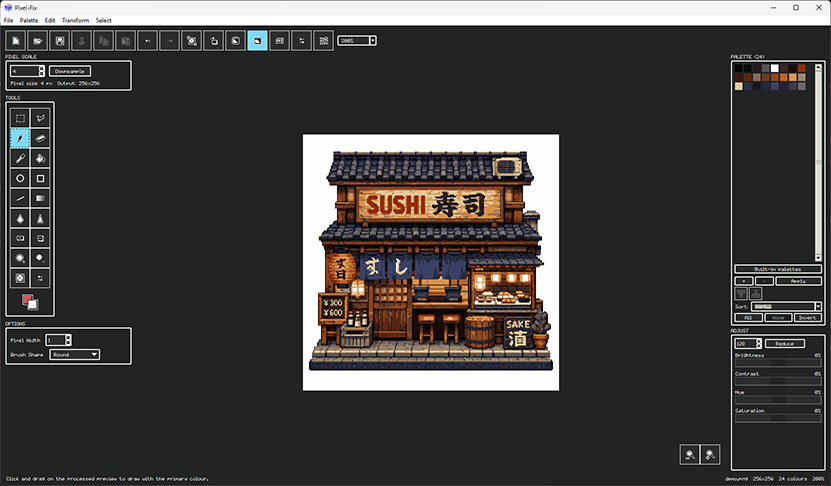
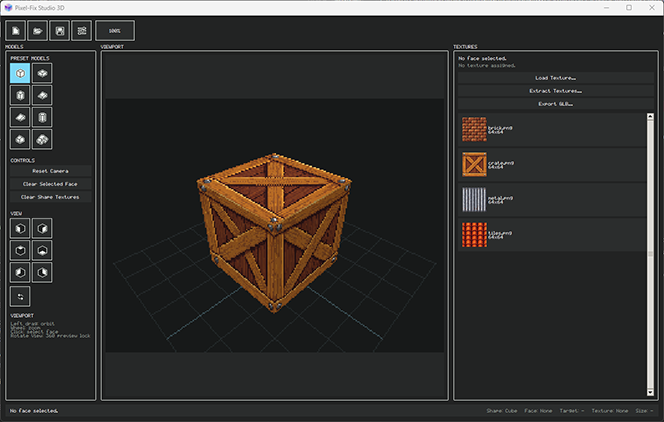

# Pixel-Fix Studio

<p align="center">
  <em>Retro pixel-art tooling in one workspace: a launcher hub, a 2D image pipeline, and a lightweight 3D face-texturing app.</em>
</p>

---

## Overview

**Pixel-Fix Studio** is the umbrella workspace for three pieces:

| Piece | Role |
| --- | --- |
| **Launcher** (`pixel-fix-studio`) | A Tkinter hub to open **Pixel-Fix 2D** and **Pixel-Fix Studio 3D**, manage optional texture/palette library folders, and revisit recent projects. |
| **Pixel-Fix 2D** | Desktop-first workflow for pixel-art PNGs: pixel scale, downsample, palette mapping, adjustments, plus drawing, selection, and filters. A CLI reuses the same pipeline for batch work. |
| **Pixel-Fix Studio 3D** | Small, focused tool: pick a preset low-poly shape, orbit the viewport, click a face, assign pixel textures, export GLB. It is not a full 3D DCC or scene editor. |

---

## Screenshots

<table>
  <tr>
    <td align="center" width="50%">
      
      <br><em>Pixel-Fix 2D — scale, palette, and paint on a processed preview.</em>
    </td>
    <td align="center" width="50%">
      
      <br><em>Pixel-Fix Studio 3D — preset mesh, PS1-style viewport, face texturing.</em>
    </td>
  </tr>
</table>

---

## Quick start

**Requirements:** Python 3.10 or newer. A virtual environment is recommended.

From the repository root (PowerShell):

```powershell
python -m venv .venv
.\.venv\Scripts\Activate.ps1
pip install -e . -e .\pixel-fix-2D -e .\pixel-fix-3D
pixel-fix-studio
```

You should see the **launcher** with cards to open **2D** and **3D** apps.

**Run apps directly** (optional):

| App | Command |
| --- | --- |
| Launcher | `pixel-fix-studio` |
| Pixel-Fix 2D (GUI) | `pixel-fix-gui` |
| Pixel-Fix 2D (CLI) | `pixel-fix --help` |
| Pixel-Fix Studio 3D | `pixel-fix-studio-3d` |

On **bash** (macOS/Linux or Git Bash), activate the venv and use the same `pip install` line with forward slashes, then run `pixel-fix-studio`.

---

## What each part does

### Launcher

Central place to start the suite: launch 2D or 3D, configure library locations, and open recent work. Implemented in [`src/pixel_fix_studio/app.py`](src/pixel_fix_studio/app.py).

### Pixel-Fix 2D

Staged pipeline for cleaning and editing pixel-art-like PNGs: set **pixel scale**, **downsample**, **apply palette**, then **adjust** colours. The GUI adds tools (selection, pencil, bucket, filters, transforms, and more). For **AI image generation** extras, optional dependencies, and full CLI reference, see the 2D README.

### Pixel-Fix Studio 3D

One preset mesh at a time, low-resolution **viewport**, **orbit** and **zoom**, **click** faces to select them, assign textures from a library, and **export GLB**. Model presets include cube, box, wedge, ramp, cylinder, roof, car, and others. See the 3D README for controls and export details.

---

## Build (release bundles)

The workspace includes a script that installs editable packages, runs tests, and builds **PyInstaller** bundles (launcher under `dist\`, portable app layout under `build\portable-apps\`). Adjust paths inside the script if your layout differs.

```powershell
.\scripts\build_all.ps1
```

Use `-SkipTests` only when you intentionally want to skip the test phase.

---

## Further reading

- [pixel-fix-2D/README.md](pixel-fix-2D/README.md) — 2D install variants, AI extras, CLI, and detailed GUI behaviour.
- [pixel-fix-3D/README.md](pixel-fix-3D/README.md) — 3D controls, presets, GLB export, and project layout.

---

## License

See the license files in this repository and in each subproject (typically MIT).
